🍽️ Damn Vulnerable RESTaurant API Game 
API intencionalmente vulnerable para aprender, practicar y mejorar seguridad en aplicaciones

---


# 📘 Introducción

La seguridad informática es hoy uno de los pilares fundamentales del desarrollo de software. Las APIs REST, al ser accesibles y expuestas, representan un objetivo constante para atacantes debido a la facilidad con la cual pueden interactuar con sus endpoints.

**Damn Vulnerable RESTaurant API Game** es un entorno vulnerable diseñado para aprender a detectar, explotar y mitigar vulnerabilidades reales en APIs mediante herramientas como Postman y metodologías de hacking ético.

Este trabajo consistió en:

- Identificar vulnerabilidades reales presentes en la API  
- Explotarlas de forma controlada  
- Implementar parches de seguridad  
- Validar las correcciones aplicadas  

---

# 🎯 Objetivo General

Analizar, explotar y mitigar vulnerabilidades presentes en la API Damn Vulnerable RESTaurant API Game, aplicando prácticas de ciberseguridad ofensiva y defensiva.

---

# 🎯 Objetivos Específicos

- Identificar vulnerabilidades en endpoints expuestos.  
- Realizar PoC (Pruebas de Concepto).  
- Implementar soluciones técnicas en el código fuente.  
- Validar la efectividad de los parches aplicados.  

---

# 🏗️ Arquitectura del Entorno

- **FastAPI (Python)**  
- **PostgreSQL**  
- **Docker + Docker Compose**  
- **Swagger / Redoc**  
- **Postman para pruebas**  

---

# ⚙️ Configuración del Entorno

## 1️⃣ Clonar repositorio
```sh
git clone https://github.com/Chichobelo/Damn-Vulnerable-RESTaurant-API-Game-2.git
cd Damn-Vulnerable-RESTaurant-API-Game-2
```

## 2️⃣ Iniciar entorno

### Modo desarrollador:
```sh
./start_game.sh
```

### Modo explotación:
```sh
./start_app.sh
```

## 3️⃣ Acceso a documentación

- Swagger → http://localhost:8091/docs  
- Redoc → http://localhost:8091/redoc  

---

# 👥 Roles en la API

| Rol | Permisos |
|-----|----------|
| **Chef** | Control total del sistema |
| **Employee** | Modificación del menú |
| **Customer** | Solo modificar su propio perfil |

---

# 🔥 Vulnerabilidades Analizadas

---

# 🧨 Nivel 1 – Unrestricted Menu Item Deletion (BOLA)

### 📝 ¿Qué ocurría?

El sistema permitía que **cualquier usuario autenticado**, incluso un Customer, pudiera borrar platos del menú.  
No existía ninguna validación de permisos antes de ejecutar la acción.

En palabras simples:

> La API no revisaba quién eras ni si tenías permisos: simplemente borraba el plato.

Esto es un caso clásico de **Broken Access Control**.

---

### 🧪 Evidencia de ataque

#### Obtener token:
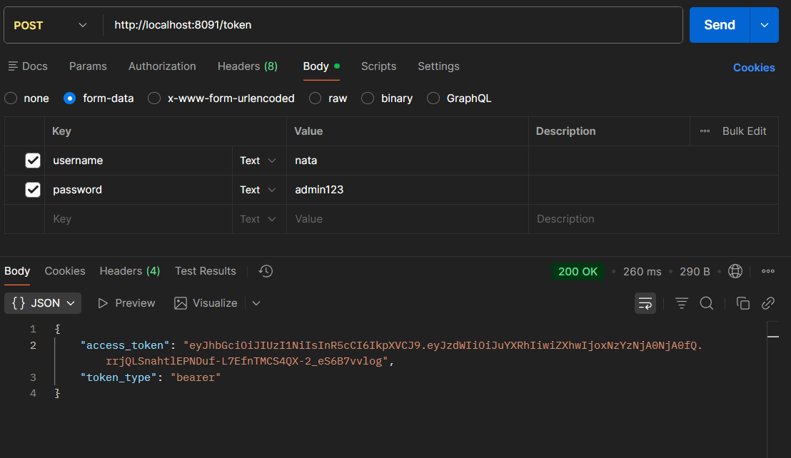

#### Eliminar item SIN permisos:
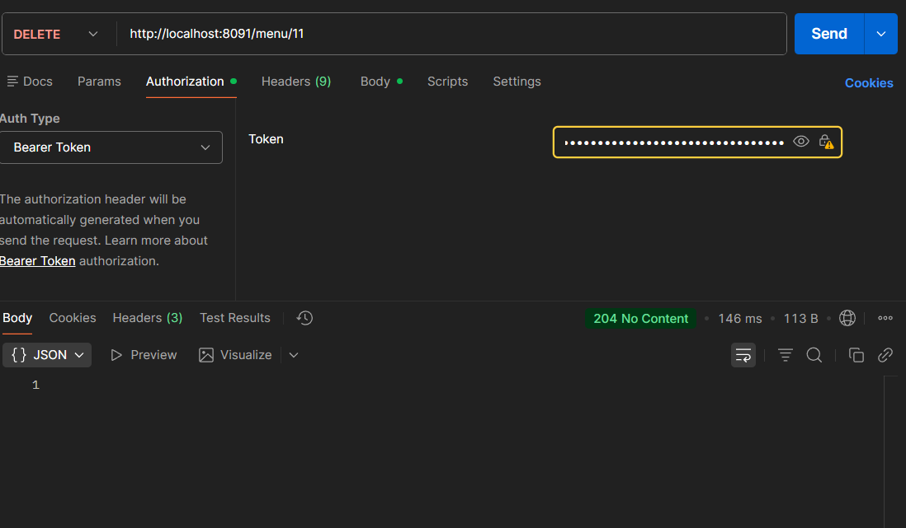

---

### ❗ ¿Por qué es grave?

- Permite que cualquiera borre información crítica.
- Puede dejar la aplicación sin datos.  
- Rompe el funcionamiento normal del negocio.

---

### ✔ Solución aplicada

Se añadió un control que verifica:

- El rol del usuario
- Si tiene permisos para eliminar  
- Si la acción corresponde a su nivel

Solo **Employee** y **Chef** pueden borrar elementos.

---

### ❌ Código vulnerable:
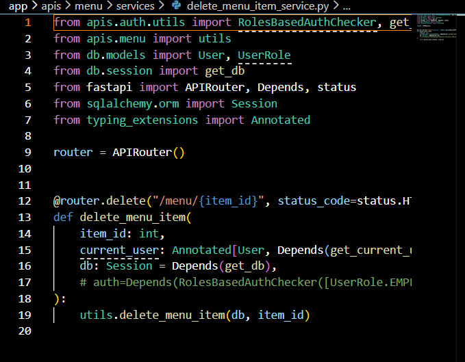

### ✔ Código corregido:
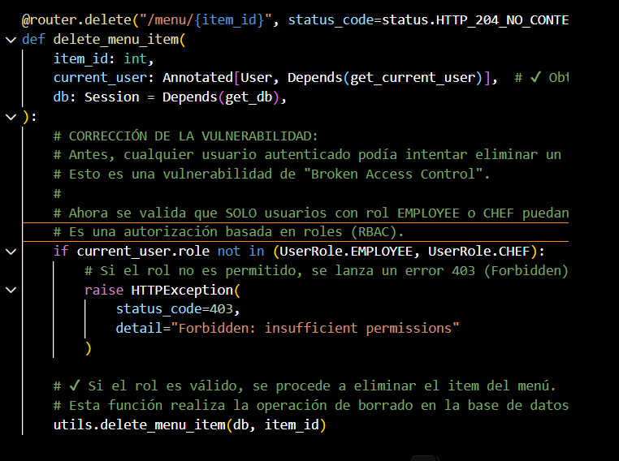  
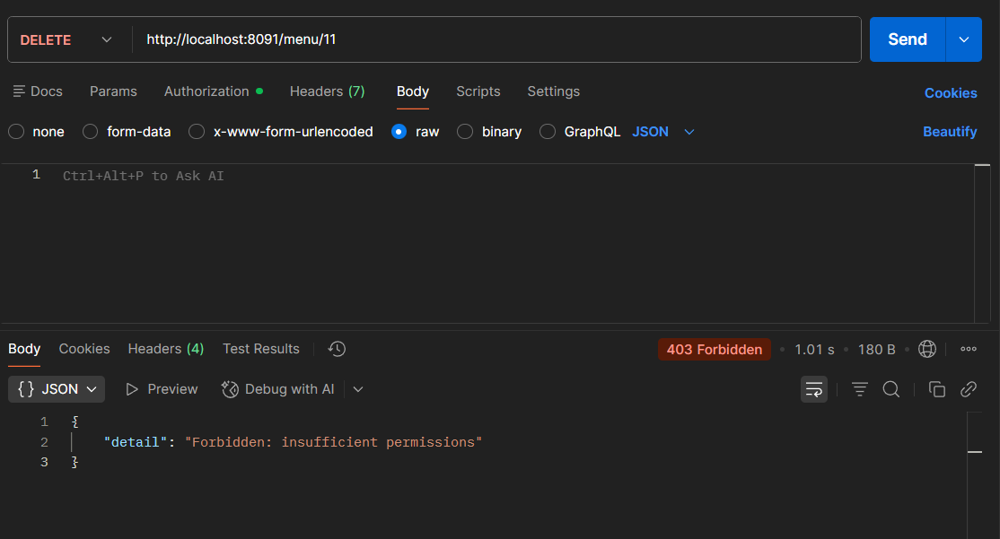

---

# 🧨 Nivel 2 – IDOR en actualización de perfil

### 📝 ¿Qué ocurría?

Un usuario podía editar el perfil de otro usuario simplemente cambiando el username en la petición.  
El servidor nunca comprobaba si el usuario tenía derecho a modificar ese recurso.

En términos simples:

> El sistema confiaba en lo que el usuario enviaba.

Esto se conoce como **IDOR (Insecure Direct Object Reference)**.

---

### 🧪 Evidencia

#### Registro de usuario:
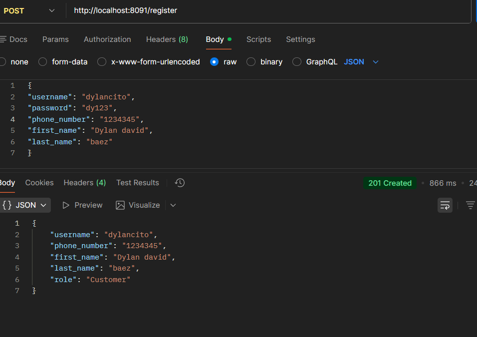

#### Cambiando datos de OTRO usuario:
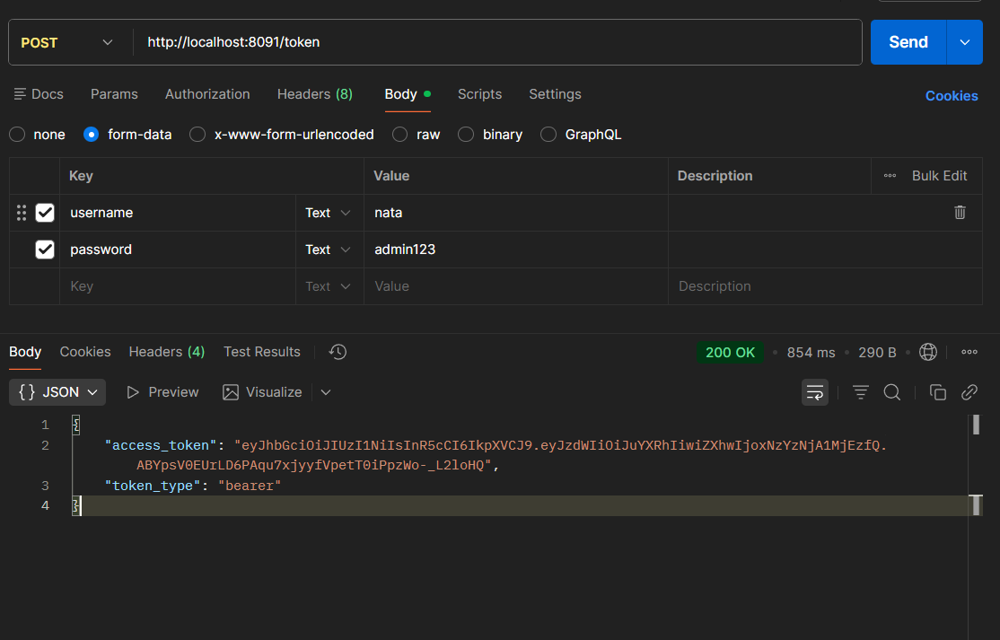
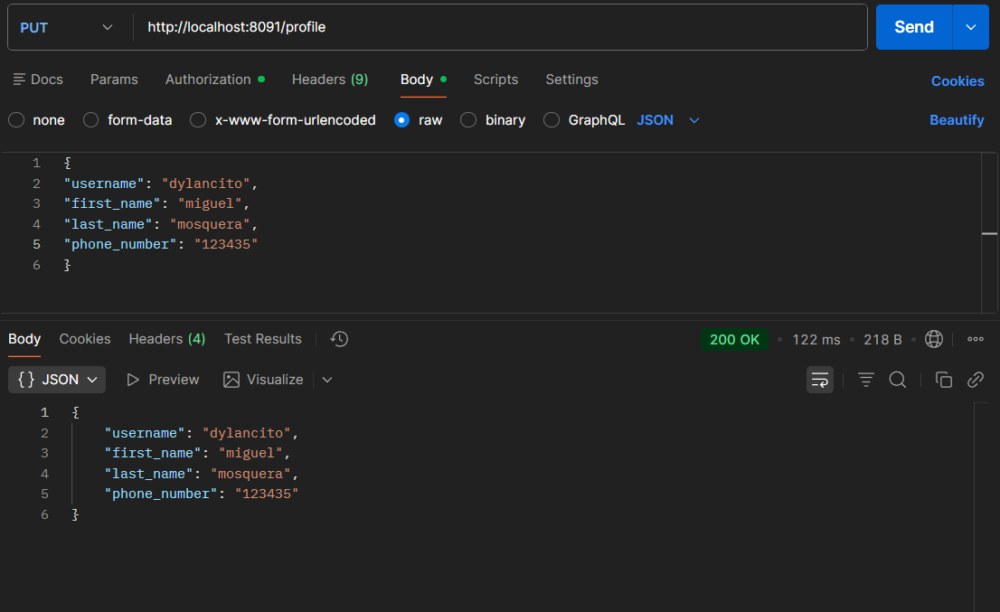

---

### ❗ ¿Por qué es grave?

- Se puede secuestrar la cuenta de otra persona.
- Se pueden cambiar datos sensibles como correo o número telefónico.
- El atacante puede recibir correos de recuperación de contraseña.

---

### ✔ Solución aplicada

- Ahora solo el **propietario** puede editar su perfil.
- Solo **Chef** puede editar perfiles ajenos.
- Se restringieron los campos que se pueden modificar.

---

### ❌ Código vulnerable:


### ✔ Código corregido:
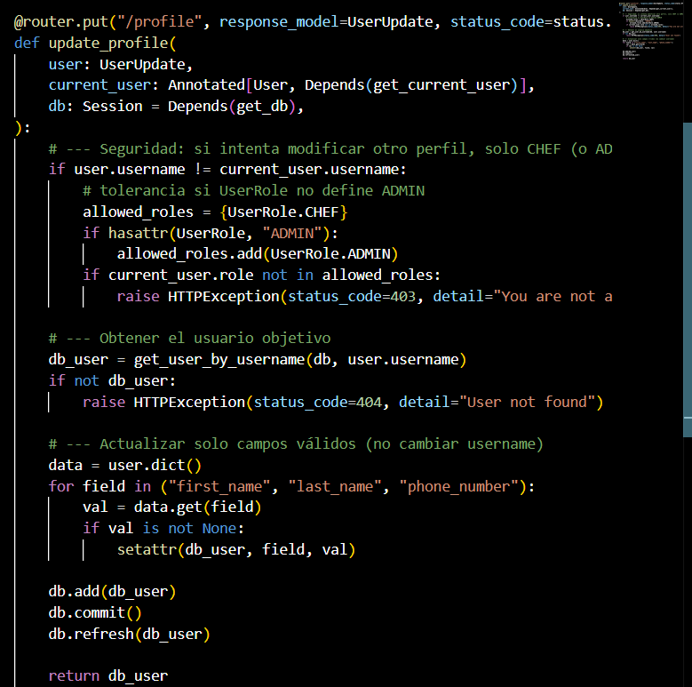

---

# 🧨 Nivel 3 – Escalación de privilegios

### 📝 ¿Qué ocurría?

Un usuario Customer podía cambiar su propio rol a Employee o Chef simplemente enviando:

```json
{ "role": "chef" }
```

En pocas palabras:

> El sistema dejaba que cualquiera se hiciera administrador.

---

### 🧪 Evidencia

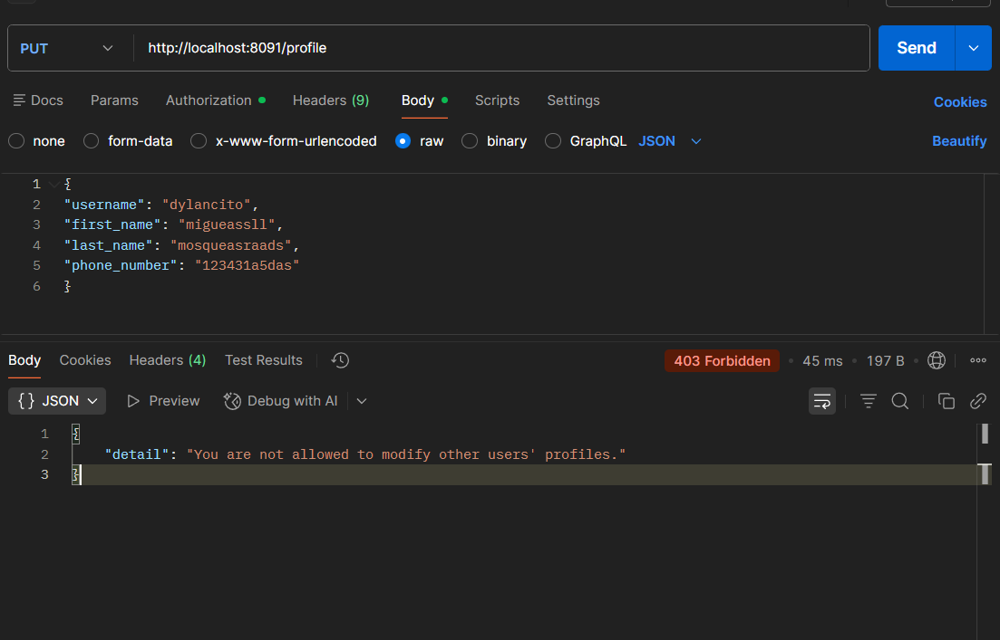

#### Cambios reflejados en la BD:
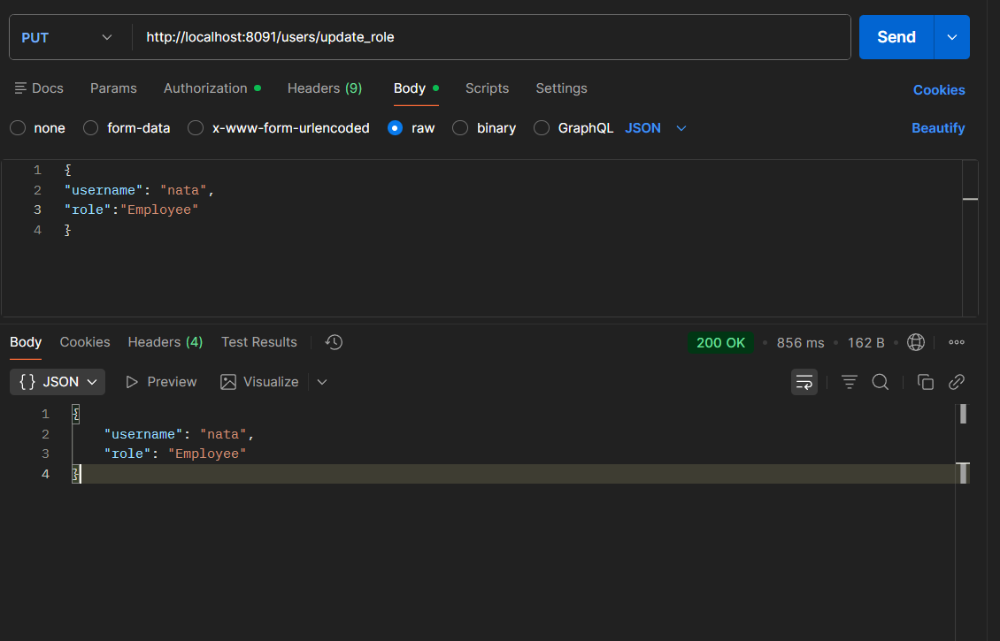  
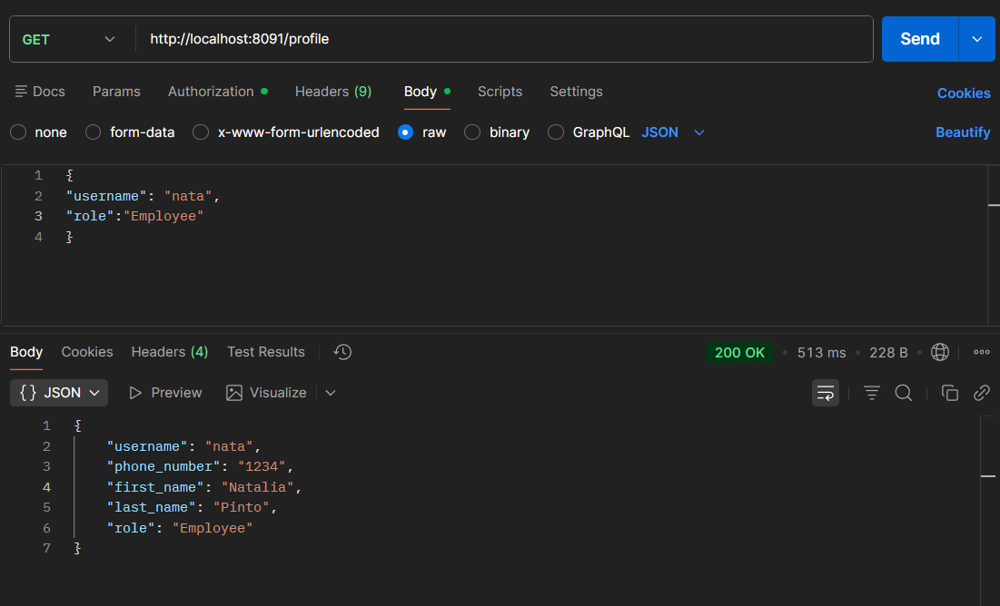

---

### ❗ ¿Por qué es grave?

- Un usuario básico obtenía control total del sistema.
- Podía borrar cuentas, editar menú, manipular pedidos, etc.
- Implica un compromiso completo de la API.

---

### ✔ Solución aplicada

- Se bloqueó el cambio de rol propio.  
- Solo **Chef** puede modificar roles.  
- Se validan identidad y permisos del solicitante.

---

### ❌ Código vulnerable:
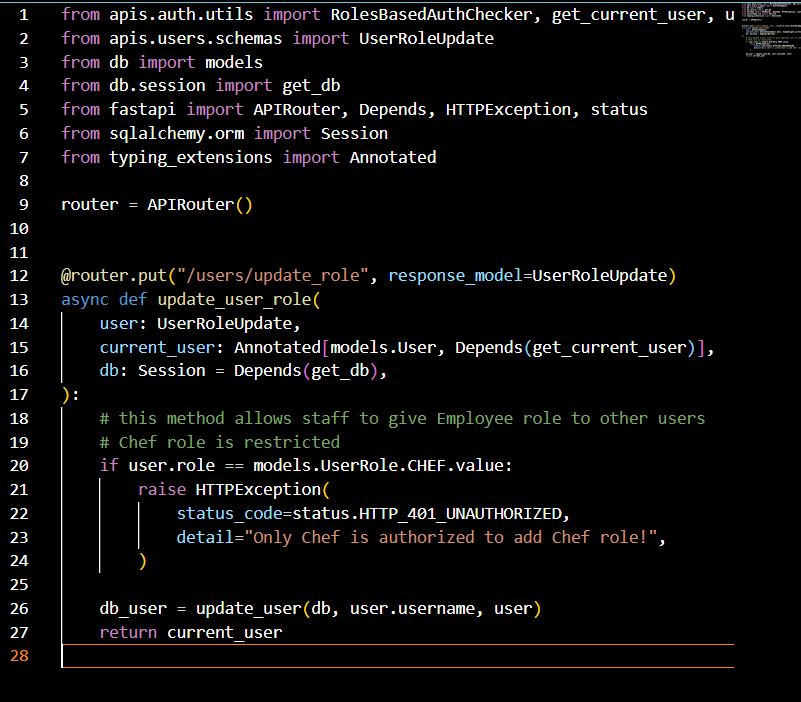

### ✔ Código corregido:
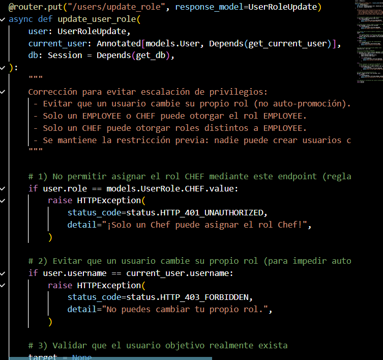

---

# 🧪 Validación final

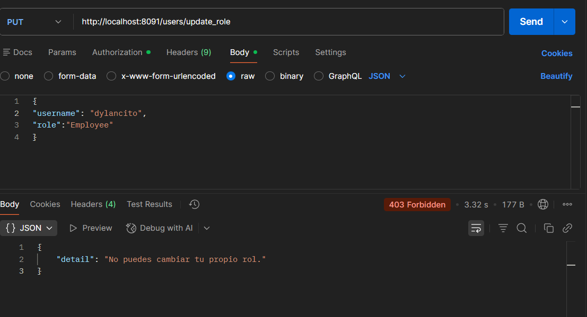

---

# 📚 Conclusión

Este trabajo demuestra cómo errores simples en control de acceso pueden generar vulnerabilidades críticas:

- Borrar información sin permisos  
- Modificar perfiles de otros usuarios  
- Convertirse en administrador sin autorización  

Después de aplicar los parches, la API quedó protegida con:

- Validación de roles  
- Validación de propietario de recurso  
- Reglas claras de autorización  

---

# 🧾 Licencia

Distribuido bajo **GPL v3.0**.

